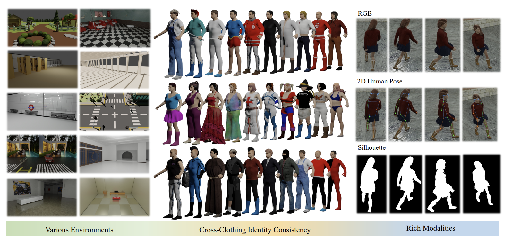

<h1 align="center">BarbieGait: An Identity-Consistent Synthetic<br />Human Dataset with Versatile Cloth-Changing<br />for Gait Recognition (CVPR 2026)</h1>

<p align="center">
  <a href="https://andyen512.github.io/" target="_blank" rel="noreferrer">Qingyuan Cai</a>
  &nbsp;·&nbsp;
  <a href="https://housaihui.cn/" target="_blank" rel="noreferrer">Saihui Hou</a>
  &nbsp;·&nbsp;
  <a href="https://scholar.google.com/citations?user=O87WSxUAAAAJ&hl=zh-CN&oi=ao" target="_blank" rel="noreferrer">Xuecai Hu</a>
  &nbsp;·&nbsp;
  <a href="https://ai.bnu.edu.cn/xygk/szdw/zgj/bfed57e2f8fc4de2a6b370063517f801.htm" target="_blank" rel="noreferrer">Yongzhen Huang</a>*
</p>

<p align="center">School of Artificial Intelligence, Beijing Normal University · AMAP, Alibaba Group · WATRIX.AI</p>

<p align="center">
  <a href="https://barbiegait.github.io/" target="_blank" rel="noreferrer">
    
  </a>
  &nbsp;
  <a href="" target="_blank" rel="noreferrer">
    
  </a>
  &nbsp;
  <a href="" target="_blank" rel="noreferrer">
    
  </a>
</p>

<p align="center">
  
</p>

## 📂 Data Preparation

### Data Directory

All datasets should be placed in:
```
your_path/BarbieGait_data/
```

### Download and Extract

1. Download data from Google Drive to `BarbieGait_data/` directory

2. Decompress:
```bash
cd your_path/BarbieGait_data/
tar -xvjf BarbieGait_predsil_pkl.tar.bz2
```

3. Create symlink to code directory:
```bash
cd your_path/BarbieGait_CVPR26_release/BarbieGait
ln -s your_path/BarbieGait_CVPR26_release/BarbieGait_data ./BarbieGait_data
```

## 📂 Data Preprocessing

This step reorganizes raw data by renaming folders according to clothing labels for easier further study.

### Folder Structure

```
BarbieGait_data/
├── BarbieGait_predsil_pkl/        # Original data (personID/clothID-seqID)
├── thick_label_by_nakeddiffnorm_eqchg/  # Clothing thickness labels
└── P2_BarbieGait_predsil_pkl/    # Output: reorganized data
    └── {subject_id}/
        └── {cloth_type}/
            └── {view_id}/
                `-- {view_id}.pkl
```

### Usage

```bash
cd BarbieGait/datasets
python create_symlnk.py
```

### Output Format

Original folder names like `cloth00-00` are reorganized to `thick{thick_value}-{seq_in_thick}-cloth00-00`, where:
- `thick_value`: Clothing thickness category (0-9)
- `seq_in_thick`: Sequence index within that thickness category

This reorganization groups sequences by clothing thickness, facilitating further cross-clothing research.

## ✅ TODO

- [ ] Release the paper link
- [ ] Release the BarbieGait dataset
- [ ] Release the GaitCLIF codebase
- [ ] Release pretrained models and configs
- [ ] Improve documentation and usage examples
