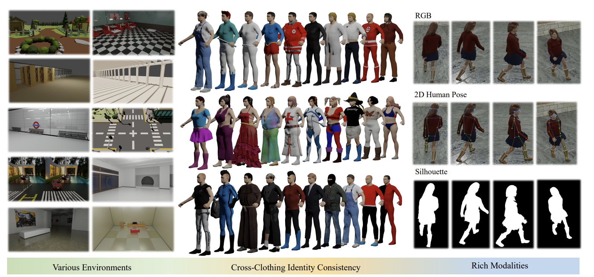

<h1 align="center"><span style="font-size: 0.8em;">BarbieGait: An Identity-Consistent Synthetic Human Dataset with Versatile Cloth-Changing for Gait Recognition</span></h1>

<p align="center">CVPR 2026</p>

<p align="center">
  <a href="https://andyen512.github.io/" target="_blank" rel="noreferrer">Qingyuan Cai</a>
  &nbsp;·&nbsp;
  <a href="https://housaihui.cn/" target="_blank" rel="noreferrer">Saihui Hou</a>
  &nbsp;·&nbsp;
  <a href="https://scholar.google.com/citations?user=O87WSxUAAAAJ&hl=zh-CN&oi=ao" target="_blank" rel="noreferrer">Xuecai Hu</a>
  &nbsp;·&nbsp;
  <a href="https://ai.bnu.edu.cn/xygk/szdw/zgj/bfed57e2f8fc4de2a6b370063517f801.htm" target="_blank" rel="noreferrer">Yongzhen Huang</a>*
</p>

<p align="center">School of Artificial Intelligence, Beijing Normal University · AMAP, Alibaba Group · WATRIX.AI</p>

<p align="center">
  <a href="https://barbiegait.github.io/" target="_blank" rel="noreferrer">
    
  </a>
  &nbsp;
  <a href="" target="_blank" rel="noreferrer">
    
  </a>
  &nbsp;
  <a href="https://arxiv.org/abs/2604.12221" target="_blank" rel="noreferrer">
    
  </a>
  &nbsp;
  <a href="https://huggingface.co/datasets/Andyen512/BarbieGait" target="_blank" rel="noreferrer">
    
  </a>
</p>

<p align="center">
  
</p>

## Dataset Access

The BarbieGait dataset is hosted on [Hugging Face](https://huggingface.co/datasets/Andyen512/BarbieGait). Please fill out the access request manually. We will handle your requests within a week. In case you encounter any issues, please feel free to reach out to us via [caiqingyuan@mail.bnu.edu.cn](mailto:caiqingyuan@mail.bnu.edu.cn).

After obtaining the data, follow the [data preparation guide](datasets/DATA_PREPROCESSING.md) to preprocess it.

## Training on BarbieGait

Prepare the required P2 data view before training. The [data preparation guide](datasets/DATA_PREPROCESSING.md) covers silhouette P2 links and pose-to-heatmap conversion.

```bash
python datasets/create_symlnk.py --modality sil
```

### Predicted Silhouette

```bash
CUDA_VISIBLE_DEVICES=0,1,2,3,4,5,6,7 python -m torch.distributed.launch \
  --master_port 13359 --nproc_per_node=8 opengait/main.py \
  --cfgs ./configs/gaitclif/GaitCLIF_BarbieGait_predsil_10layer_p3d_261p.yaml \
  --phase train --log_to_file
```

### Predicted Pose Heatmaps

```bash
CUDA_VISIBLE_DEVICES=0,1,2,3,4,5,6,7 python -m torch.distributed.launch \
  --master_port 13359 --nproc_per_node=8 opengait/main.py \
  --cfgs ./configs/gaitclif/GaitCLIF_BarbieGait_predpose_10layer_261p.yaml \
  --phase train --log_to_file
```

## ✅ TODO

- [x] Release the paper link
- [x] Release the BarbieGait predicted silhouette and 2D pose
- [x] Release the GaitCLIF codebase
- [x] Improve documentation and usage examples
- [ ] Release the BarbieGait rendered ground truth silhouette and rendered RGB data
